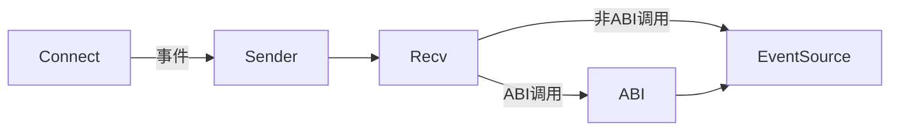
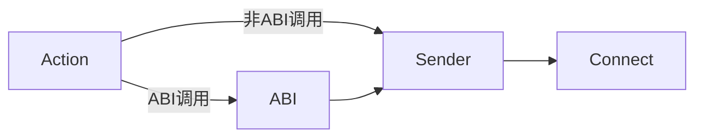
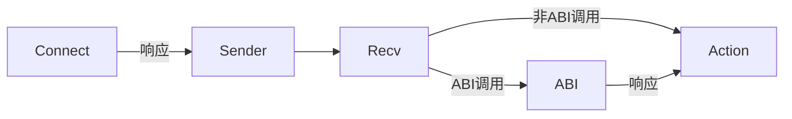
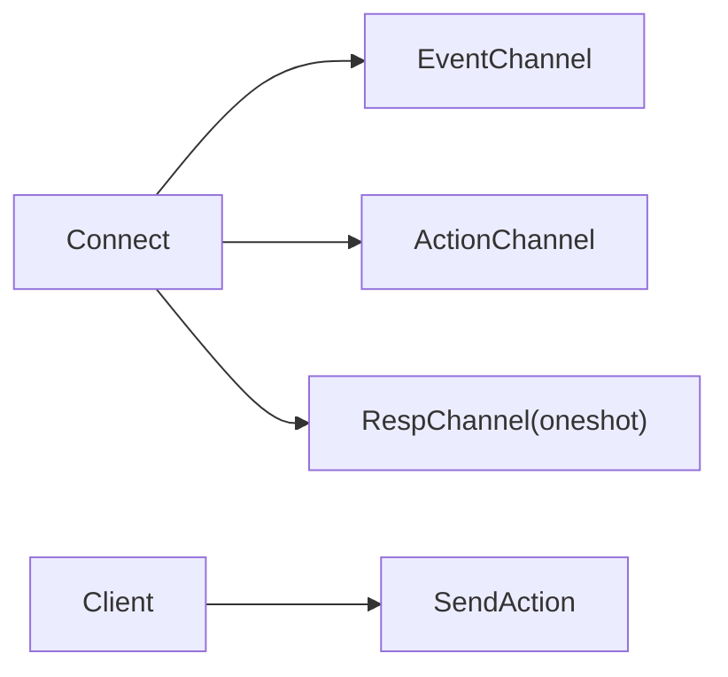

```mermaid
graph LR
    Connect-->|事件|Sender-->Recv
    Recv-->|非ABI调用|EventSource
    Recv-->|ABI调用|ABI-->EventSource
```

```mermaid
graph LR
    Action-->|非ABI调用|Sender-->Connect
    Action-->|ABI调用|ABI-->Sender
    
```

```mermaid
graph LR
    Connect-->|响应|Sender-->Recv
    Recv-->|非ABI调用|Action
    Recv-->|ABI调用|ABI-->|响应|Action
```

```mermaid
graph LR
    Connect-->EventChannel
    Connect-->ActionChannel
    Connect-->resp_chan["RespChannel(oneshot)"]
    
    Client-->SendAction
```
